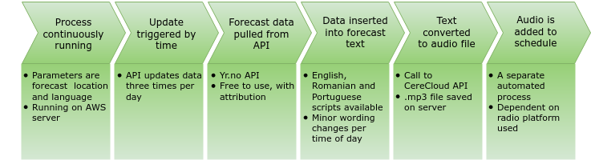

## Overview of TTS Weather Forecaster

## Forecast data source
[Yr.no](https://www.yr.no/)
[API help](https://hjelp.yr.no/hc/en-us)
Open source weather forecasts with free to use (with attribution) weather API. This site is already in use by community members in SG. See below for discussion of selecting a weather API. The current project uses **short term forecasts**.

#### Scheduling
Forecast data is updated on yr.no API two to four times a day, depending on the type and location of forecast.
The current weather application generates new forecast audio on the following schedule 6:00, 12:00, 18:00, 00:00 (this is triggered by run_weather.py). 

### Translation tables
Non-numeric data (weather description, wind direction) provided by the API is translated to the target language using translation tables. If additional language functionality is added, these tables will need to be updated.

https://github.com/ks555/tts_apps/weather/direction_translation_yrno.csv
https://github.com/ks555/tts_apps/weather/weather_translation_yrno.csv

## Technical setup

### Python application
https://github.com/ks555/tts_apps
### AWS
AWS account: kristenmscott@hotmail.com  contact Kristen Scott at this email address.

A python application is being run on an AWS ec2 instance using *screens*. Generated audio is saved in an S3 bucket (sent there through a bash script also running on a screen). 

The S3 bucket is formatted as a simple file hosting website (using an index.html file). The bucket and all files are completely public, which is required for this hosting capability.

Files are named by date with _0, _1, _2 to indicate time of day of forecast. In the case of the Romanian stations, they have their own code running that pulls the most recent file and places it on the appropriate place in their schedule.

### Speech synthesis
Currently generates speech audio through cerecloud API from cereproc, using Rootio credentials which recieves free credits from Cereproc for the duration of the project.

## Forecast text content
Example text of  a forecast in english.*[words in italics vary based on time of day, location and forecast]*.

 *[Good morning] [location]*. The forecast for this *[morning]* from *[6:00]* is *[clear sky]*, with a temperature of *[10]* degrees, with wind of *[8,2]* meters per second in the *[easterly]* direction. The forecast for the *[afternoon]* from *[12:00]* to *[18:00]* is *[cloudy]*, with a temperature of *[10]* degrees, with wind of *[5,8]* meters per second in the *[south-west]* direction. Weather forecast provided by YR.no application, the Norwegian Meteorological Institute and NRK.

## Weather forecasting domain information
### Choosing a weather service - considerations

There are several apis with international (and hyper local) weather forcasts in multiple languages. Something to note is that though you can get hyper local forecasts, there are just interpolated values based on actual weather data from specific locations. Similarly, though you can access hour by hour forecast data, these numbers have also been interpolated at one specific time and are not updated hourly. Forecasts will get updated approx. 1-4 times per day, depending on the service.

A prewritten forecast written (as in written in full sentances to be read aloud) in a station language, for a station location may exist in some cases, but usually does not, and if it does is likely copyrighted and not free to use without permission / large payment. This necessitates the present method of inserting data into a pre-written script. 

[ipma.pt](http://ipma.pt) - has cool Madeira summary in RSS, no specific locations. This kind of source is great to include on a per station bases through a different TTS method (RSS or Podcast to TTS methods)

[tempo.pt](http://tempo.pt) - api doesn't include CdF but site does - summaries in portuguese are decent. I don't trust the accuracy at all and I have been monitoring it...it doesn't update multiple times a day? imited as to what kind of summary is available written and how often it is updated (sometimes the summary forcast is for the morning even though it is already afternoon).

accuweather.com (global, api available) - summaries in pt are machine translated and error prone it is rated as one of the most accurate sites.

darksky.net (global, api available) - summaries in pt are machine translated and error prone. Less accurate than accuweather (as of 2016 study).

yr.no uses a simple xml method to deliver weather data. Is free to use with attribution and is currently in use in the Romanian communities.

